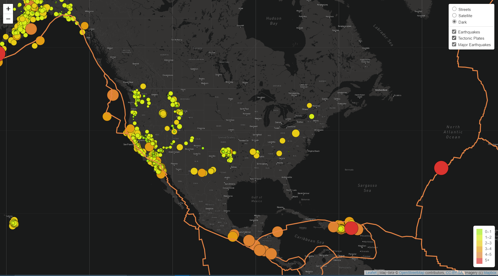

# Mapping_Earthquakes

## Purpose
The purpose of this project is to visually show the differences between the magnitudes of earthquakes for the last seven days.

## Tasks
To complete this project, I used GeoJSON earthquake data from the USGS website. The data included  geographical coordinates and the magnitudes of earthquakes for the last seven days. I then added the data to a map.

## Approach
I used the JavaScript and the D3.js library to retrieve the coordinates and magnitudes of the earthquakes from the GeoJSON data. I also used the Leaflet library to plot the data on a Mapbox map through an API request and create interactivity for the earthquake data.

## Output
The final output is located in the `Earthquake_Challenge` folder, which contains an `index.html` file, a `static` folder with a `style.css` file and the `challenge_logic.js` javascript code to run the map from a Python Server.
The other folders in this repository contain practice drafts and show some of my practice with the materials.

The map I created has multiple overlays, including options that allow visitors to view the location of tectonic plates, major earthquakes and other relevant data.

Screenshot of final output:

